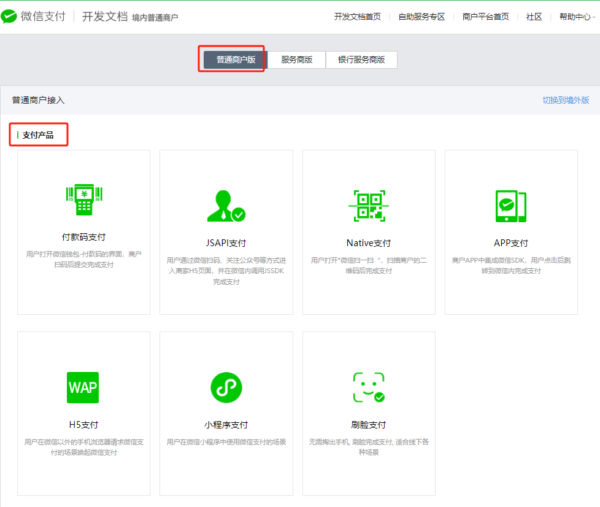
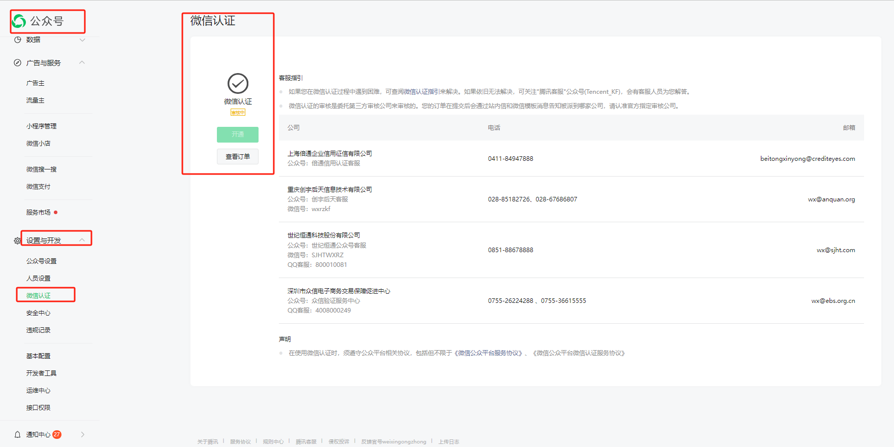

### 微信JSAPI支付

[产品介绍](https://pay.weixin.qq.com/docs/merchant/products/jsapi-payment/introduction.html)

[接入前准备](https://pay.weixin.qq.com/docs/merchant/products/jsapi-payment/preparation.html)

[开发指引](https://pay.weixin.qq.com/docs/merchant/products/jsapi-payment/development.html)

[API列表](https://pay.weixin.qq.com/docs/merchant/products/jsapi-payment/apilist.html)

[开发者社区](https://developers.weixin.qq.com/community/pay)

**整体原则就是按照官方文档一步一步来**

---

支付产品

微信认证

**注意：只有服务号才能对接微信支付。每年都需要花300块认证费用。**

### 按照下面步骤操作

---
#### 1. 准备工作
* 注册微信支付商户号：如果您还没有微信支付的商户号，需要先去微信支付官网申请一个。
* 获取API密钥：在微信支付商户平台中设置并获取API密钥。
* 证书下载：从微信支付商户平台下载商户证书，用于后续的签名验证等安全措施。
* 配置微信支付参数：在您的 Spring Boot 应用中配置微信支付所需的参数，如 appid、mch_id（商户号）、api_key 等。

#### 2. 创建订单
* 生成预支付交易会话标识：使用微信支付提供的接口（统一下单 API），向微信服务器发送请求，传入必要的订单信息（如商品描述、订单金额、回调地址等），获取 prepay_id。
* 封装JSAPI参数：根据微信支付文档，将 prepay_id 等信息封装成前端调用所需的数据格式，并进行签名。

#### 3. 前端调用支付
* 调用微信JS-SDK：在前端页面中，通过调用微信的JS-SDK方法 wx.chooseWXPay 或者新版的 wx.requestPayment 发起支付请求。
* 用户完成支付：用户在微信客户端中完成支付操作。

#### 4. 后台处理支付结果
* 接收支付通知：微信支付成功后，微信服务器会向您配置的回调地址发送支付结果通知。
* 验证支付结果：对接收到的通知数据进行校验，确保数据的真实性和完整性。
* 更新订单状态：根据支付结果更新您的系统中的订单状态。
* 响应微信服务器：向微信服务器返回确认信息，表明已成功接收到支付结果通知。

#### 5. 完成支付后的操作
* 发送支付成功的消息给用户：可以通过微信模板消息等方式通知用户支付结果。
* 提供相应的服务或商品：根据业务需求，为用户提供购买的服务或商品。

---

**任何疑问添加微信咨询**
